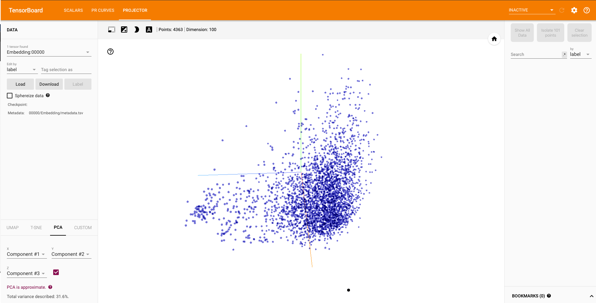
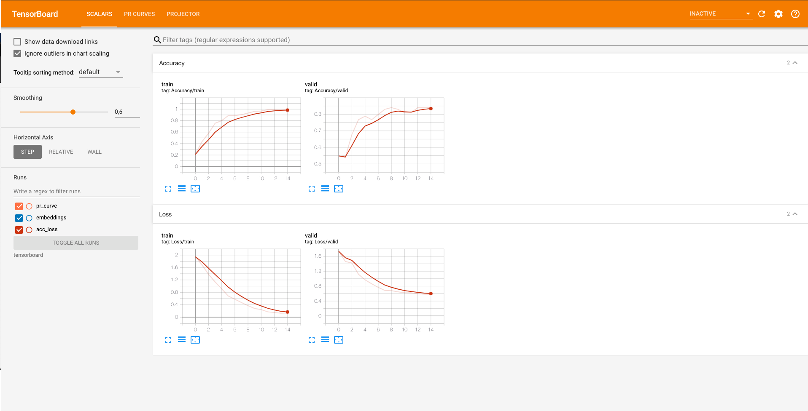
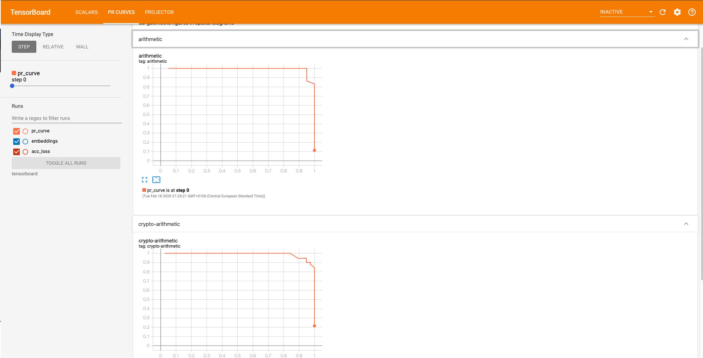

# CNNs applied to Math Exercises classification

Work in progress repository that implements Multi-Class Text Classification using a CNN (Convolutional Neural Network)  for a [Deep Learning university exam](http://www.unife.it/ing/lm.infoauto/deep-learning/scheda-insegnamento-1/en) using [PyTorch](https://github.com/pytorch/pytorch) 1.3, [TorchText](https://github.com/pytorch/text) 0.5 and Python 3.7.
It also integrates [TensorboardX](https://github.com/lanpa/tensorboardX), a module for visualization with Google’s tensorflow’s Tensorboard (web server to serve visualizations of the training progress of a neural network). 
TensorboardX gives us the possibility to visualize embeddings, PR and Loss/Accuracy curves. 

I've started this project following [this awesome tutorial](https://github.com/bentrevett/pytorch-sentiment-analysis) that perfectly shows how to perform sentiment analysis with PyTorch. The convolutional approach to sentences classification takes inspiration from [Yoon Kim's paper](https://arxiv.org/abs/1408.5882).

The achievement of this particular application of [convolutional neural networks](https://arxiv.org/abs/1408.5882) to Text Classification is to being able to categorize 7 different classes of Italian Math/Calculus exercises, using a small, but balanced dataset.
For example, given a 4D optimization Calculus exercise to the input, the NN should be able to categorize that exercise as a 4D optimization problem.

## Feats

- Export datasets with a folder hierarchy (eg. test/label_1/point.txt) from txt to JSON files (with TEXT and LABEL as fields)
- Import custom datasets
- Train, evaluate and save model's state
- Make a prediction from user's input
- Print infos about dataset and model
- Test NLPAug a library for Data Augmentation in NLP
- Plot Accuracy, Loss and PR curves - TensorboardX 
- Visualize the embedding space projection - TensorboardX 


## Model summary

```batch
Embedding dimension: 100 
N. of filters: 400 
Vocab dimension: 4363 
Filter Sizes = [2, 3, 4]
Batch Size = 32
Categories:
   3D geometric figures in spatial diagrams
   arithmetic
   crypto-arithmetic
   numbers in spatial diagrams
   temporal reasoning
   spatial reasoning
   geometric figures in spatial diagrams OR puzzle
===================================================
Layer (type)         Output Shape         Param 
===================================================
Embedding-1          [-1, 32, 100]        436,300
Conv2d-2           [-1, 400, 31, 1]         80,400
Conv2d-3           [-1, 400, 30, 1]        120,400
Conv2d-4           [-1, 400, 29, 1]        160,400
Dropout-5                [-1, 1200]              0
Linear-6                    [-1, 7]          8,407
===================================================
Total params: 805,907
Trainable params: 805,907
Non-trainable params: 0

Best Test Loss achieved: 0.654
Best Test Accuracy achieved: 83.33%

```

## Getting Started

To install PyTorch, see installation instructions on the [PyTorch website](pytorch.org).

Install TorchText, Inquirer, TorchSummary* and TensorboardX:

``` bash
pip install inquirer
pip install tensorboardX
pip install torchsummary
pip install torchtext
```

 SpaCy is required to tokenize our data. To install spaCy, follow the instructions [here](https://spacy.io/usage/) making sure to install the Italian models with:

``` bash
python -m spacy download it_core_news_sm
```

I've tried two different embeddings - to build the vocab and load the pre-trained word embeddings - you can download them here:
- [Human Language Technologies - CNR](http://hlt.isti.cnr.it/wordembeddings/)
- [Suggested] [Italian CoNLL17 corpus](http://vectors.nlpl.eu/repository/) (filtering by language) 

You should extract one of them to **vector_cache** folder and load it from **dataset.py**.
For example:
```python
vectors = vocab.Vectors(name='model.txt', cache='vector_cache/word2vec_CoNLL17')
```

I'd anyway suggest to use Word2Vec models as I've found them easier to integrate with libraries such [nlpaug - Data Augmentation for NLP](https://github.com/makcedward/nlpaug) 

After have performed any TensorboardX related operation remember to run 
``` bash
 tensorboard --logdir=tensorboard    
```

 **Due to a Torchsummary [issue with embeddings](https://github.com/sksq96/pytorch-summary/issues/42) you should change the dtype from FloatTensor to LongTensor in its source file in order to have the summary of the model in a Keras-like way**


## Dataset

This project works on a custom private dataset.
You can import your own .txt dataset just adopting the following folder pattern.
```batch
/ezmath/
...
...
|-- dataset_folder
|   |-- test
|   |-- train
|   |-- validation
|   |   |-- whatever_label_1
|   |   |-- whatever_label_1
|   |   |-- ...
|   |   |-- ...
|   |   |-- whatever_label_X
|   |   |   |-- whatever_1.txt
|   |   |   |-- whatever_2.txt
|   |   |   |-- ...
|   |   |   |-- ...
|   |   |   |-- whatever_Y.txt
```
`load_dataset()` will create a `data` folder with three JSON files `test.json`, `train.json`, `validation.json` 
every JSON will contain Y entries. Every entry will have 2 fields: `text` and `label`.

For eg.
```json
{"text": ["This", "was", "a", ".txt"], "label": "whatever_label_X"}
```
## TensorboardX screenshots

### Embeddings



### Accuracy and Loss curves


### PR curves


## References

- http://anie.me/On-Torchtext/
- https://github.com/lanpa/tensorboardX
- https://radimrehurek.com/gensim/models/word2vec.html#module-gensim.models.word2vec
- https://stats.stackexchange.com/questions/164876/tradeoff-batch-size-vs-number-of-iterations-to-train-a-neural-network
- https://magmax.org/python-inquirer/examples.html
- https://pytorch.org/docs/stable/tensorboard.html?highlight=tensorboard
- http://www.erogol.com/use-tensorboard-pytorch/
- https://github.com/sksq96/pytorch-summary
- https://arxiv.org/abs/1408.5882

